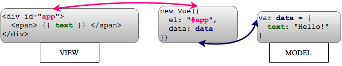
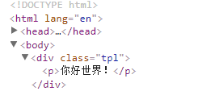
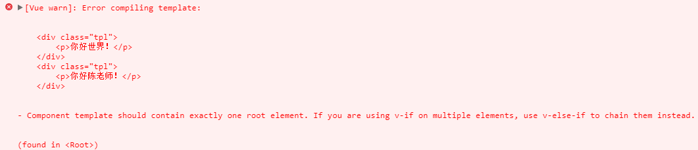
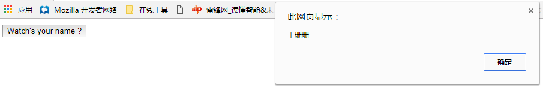
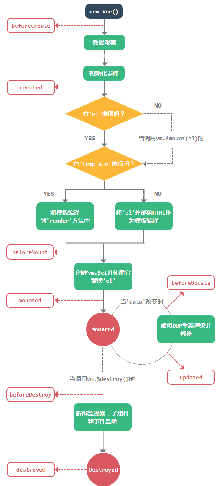
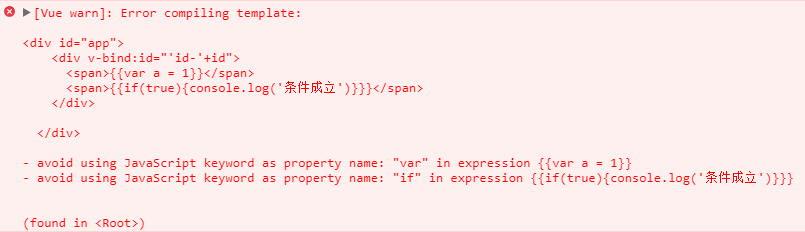

[TOC]
# Vue.js简介

其实，无论前端框架如何变化，它需要处理的事情依然是模板渲染、事件绑定、处理用户交互（输入信息或鼠标操作），只不过提供了不同的写法和理念。Vue.js则会通过声明一个实例`new Vue({options})`标记当前页面的HTML结构、数据的展示及相关事件的绑定。这一课我们主要介绍Vue.js的构造函数的选项对象及用法，以及如何通过Vue.js来实现上述的常规前端功能。


# Vue开发者工具

## 使用说明

1. 如果页面使用VUE.JS的生成/精简构建，默认情况下禁用DeVoices检查，因此VUE窗格不会出现。
2. 为了使它通过文件：//协议打开的页面工作，需要在Chrome的扩展管理面板中检查“允许访问文件URL”。

## 下载工具

- [获取 Chrome 扩展（由于国内特殊的网络限制，所以此路不通）][1]
- [获取 Firefox 插件][2]
- [获得独立的应用程序（与任何环境一起工作！）][3]


## 手动安装

确保你正在使用的 Node 版本在 6.0.0 以上，npm 版本在 3.0.0 以上。

1. 克隆 [Vue-Devtools](https://github.com/vuejs/vue-devtools#vue-devtools) 仓库
2. 进入【vue-devtools】目录，使用 `npm install` 命令安装本仓库依赖的包
3. 执行 `npm run build` 命令
4. 打开 Chrome 浏览器菜单中的【扩展程序】
5. 启用【开发者模式】
6. 点击【已解压的扩展程序】，选择 `shells/chrome` 目录，确定即可。

## 常见的问题和解决方法

1. 使用 file:// 协议本地工作时，控制台总是输出：'Download the Vue Devtools for a better development experience'。

   在浏览器右上角的 Vue-Devtools 图标上右键单击，选择【管理扩展程序】，然后选中【允许访问文件地址】

2. 怎样在 IE/Edge/Safari 或其他任何浏览器中使用 Vue-Devtools ？[获得独立的应用程序][3]


[1]: https://chrome.google.com/webstore/detail/vuejs-devtools/nhdogjmejiglipccpnnnanhbledajbpd "Get the Chrome Extension"
[2]: https://addons.mozilla.org/en-US/firefox/addon/vue-js-devtools/ "Get the Firefox Addon"
[3]: https://github.com/vuejs/vue-devtools/blob/master/shells/electron/README.md "Get standalone Electron app"


# 实例及选项

通过前面的例子了解到，我们可以使用构造函数`Vue({option})`创建Vue实例：`var vm = new Vue({options})`。Vue实例相当于**MVVM**模式中的**ViewModel**，`data`对象是我们的**Model**，Vue实例的挂载点元素是我们的**View**，如下图所示：



在实例化Vue的时候，我们可以传入一个选项对象，包含数据、模板、挂载元素、方法、生命周期方法等选项。下面我们就对这些选项进行具体的说明。

## 模板

选项中主要影响模板或DOM元素的选项有`el`和`template`。

+ `el` 其作用是提供一个在页面上已经存在的DOM元素作为Vue实例的挂载目标。可以是CSS选择器，也可以是一个HTMLElement实例。
+ `template`  字符串模板。会被挂载到`el`指定的挂载点元素上，挂载点元素及其内部的HTML代码都会被模板内容替换掉，除非模板的内容有分发`slot`。

在使用`template`选项时，我们往往不会把所有的HTML代码直接写到JS中，这样不但影响代码可读性而且不利于后期维护。所以我们经常将模板代码放到`<script id="tpl" type="x-template"></script>`标签中，然后将`id`属性的值`#tpl`赋值给`template`选项，这样就能将HTML代码从JS中分离出来，实例如下：

```html
<div id="app" class="main">
    <p>Hello world!</p>
</div>

<script id="mytemplate" type="x-template">
    <div class="tpl">
        <p>你好世界！</p>
    </div>
</script>

<script>
    var vm = new Vue({
        el: '#app',
        template: '#mytemplate'
    });
</script>
```

最终输出的HTML结构为：



页面中的挂载点元素被模板代码替换掉了，并且挂载点元素的`class="main"`属性也不复存在了。

Vue.js 2.0要求模板代码必须要有一个根元素，即不允许组件模板为：

```html
<script id="mytemplate" type="x-template">
    <div class="tpl">
        <p>你好世界！</p>
    </div>
    <div class="tpl">
        <p>你好陈老师！</p>
    </div>
</script>
```

这样做会导致如下的错误：



像这样由多个兄弟节点组成的模板代码，需要统一写到一个根元素中，如下例所示：

```html
<script id="mytemplate" type="x-template">
    <div class="root">
        <div class="tpl">
            <p>你好世界！</p>
        </div>
        <div class="tpl">
            <p>你好陈老师！</p>
        </div>
    </div>
</script>
```

## 数据

Vue实例中可以通过`data`选项定义数据，这些数据可以在实例对应的模板中进行绑定并使用。需要注意的是，如果赋值给`data`选项的是一个对象，Vue实例会接管起`student`对象中所有的属性，而不会对传入的对象进行深拷贝。另外，我们也可以引用Vue实例`vm`中的`$data`来获取声明的数据，例如：

```html
<div id="app">
      <h4>{{name}}</h4>
</div>
<script src="./vue.js"></script>
<script>
   
  var student = {
      name: '杨国兴'
  };

  var vm = new Vue({
      el: '#app',
      data: student
  });

  console.log(vm.$data === student)       // true
  console.log(vm.name === student.name )  // true

  // 设置属性也会影响到原始数据
  vm.name = '冯晨飞';
  console.log(student.name);              // '冯晨飞'

  // 反之亦然
  student.name = '李天明';
  console.log(vm.name);                   // '李天明'
</script>
```

然后我们可以在模板中使用`{{name}}`就会输出`vm.name`的值，并且修改`vm.name`的值，模板中的值会随之改变，我们称这样的数据为响应式数据。

>注意，在初始化Vue实例的时候，尽量把所有变量的都设置好，如果事先不知道变量的值是什么，可以用`undefined`或`null`占位。

## 方法

我们可以通过`methods`对象定义Vue实例的方法，然后使用`v-on`指令来监听DOM事件，例如：

```html
  <div id="app">
    <button v-on:click="sayName">Watch's your name ?</button>
  </div>
  <script>
    var vm = new Vue({
        el: '#app',
        data: {
          name: '王珊珊'
        },
        methods: {
          sayName: function(){
            alert(this.name);
          }
        }
    });
  </script>
```

当点击按钮时就会弹出姓名：



## Vue实例的生命周期

在创建Vue实例时会进行一系列的初始化步骤，比如建立数据观察，编译模板，创建数据绑定等。在此过程中，我们可以使用一些定义好的声明周期方法处理业务逻辑。




生命周期方法：

方法         |说明
-------------|------------------------------------------------------------------------------------------
beforeCreate |在实例初始化时同步调用。此时数据观察、事件等都尚未初始化。
created      |在实例创建之后调用。此时已完成数据绑定、事件方法，但尚未开始DOM编译，未挂载到`document`中。
beforeMount  |在`mounted`之前执行。
mounted      |在编译结束时调用。此时所有指令已生效，数据变化已能触发DOM更新，但不保证`$el`已经插入文档。
beforeUpdate |在实例挂载之后，再次更新实例（比如，更新`data`）时调用该方法，此时尚未更新DOM结构。
updated      |在实例挂载之后，再次更新实例并更新完DOM结构之后调用。
beforeDestroy|在开始销毁实例时调用，此时实例仍然有效。
destroyed    |实例被销毁之后调用。此时所有绑定和实例指令都已经解绑，子实例也被销毁。
activated    |在动态组件初始化渲染的过程中调用该方法，需要配合动态组件`keep-alive`属性使用。
deactivated  |在动态组件移出的过程中调用该方法，需要配合动态组件`keep-alive`属性使用。

```javascript
    var vm = new Vue({
      el: '#content',
      template: '#tpl',

      beforeCreate: function(){
        console.log('beforeCreate');
      },
      created: function() {
        console.log('created');
      },
      beforeMount: function(){
        console.log('beforeMount');
      },
      mounted: function(){
        console.log('mounted');
      },
      beforeUpdate: function(){
        console.log('beforeUpdate');
      },
      updated: function(){
        console.log('updated')
      },
      beforeDestroy: function(){
        console.log('beforeDestroy');
      },
      destroyed: function(){
        console.log('destroyed');
      }
    });
```

# 模板语法

## 插值

在这里我们主要介绍Vue.js的数据绑定语法，后面出现的例子会基于以下JS代码：

```javascript
    var vm = new Vue({
        el: '#app',
        data: {
            id: 1,
            index: 0,
            name: 'Vue',
            avatar: '',
            count: [1,2,3,4,5],
            names: ['Vue1.0', 'Vue2.0'],
            items: [
                
            ]

        }
    });
```

### 插入文本

数据绑定最基础的形式就是文本插值，使用的是双大括号标签`{{}}`，示例如下：

```html
    <span>Hello {{name}}</span>     // 'Hello Vue'
```

Vue的实例`vm`中`name`属性的值将会替换双大括号标签中的`name`，并且修改数据对象中的`name`属性，页面中的DOM也会随之更新。例如在浏览器控制台中运行`vm.name = 'Vue 1.0'`，输出结果为`Hello Vue 1.0`。

模板语法同时也支持单次插值，即首次赋值后再更改`vm`实例属性值不会引起DOM变化。使用`v-once`指令重新改写以上模板：

```html
<span v-once="name">Hello {{name}}</span> 
```

即使在浏览器控制台中运行`vm.name = 'Vue 1.0'`，页面中的DOM元素也不会发生改变。

### 插入标签

双大括号会将数据解释为普通文本，而非 HTML 代码。为了输出真正的 HTML，你需要使用 `v-html` 指令：

```html
<p>Using mustaches: {{ rawHtml }}</p>
<p>Using v-html directive: <span v-html="rawHtml"></span></p>
```
这个 span 的内容将会被替换成为属性值 rawHtml，直接作为 HTML——会忽略解析属性值中的数据绑定。注意，你不能使用 v-html 来复合局部模板，因为 Vue 不是基于字符串的模板引擎。反之，对于用户界面，组件更适合作为可重用和可组合的基本单位。

> 你的站点上动态渲染的任意 HTML 可能会非常危险，因为它很容易导致 XSS 攻击。请只对可信内容使用 HTML 插值，绝不要对用户提供的内容使用插值。

### 标签属性

想要HTML属性中插入值的话，需要使用`v-bind指令`，例如：

```html
<div v-bind:id="'id-'+id"></div> 
```

或则简写成：

```html
<div :id="'id-'+id"></div> 
```

### 表达式

放在`{{}}`中的文本内容称为绑定表达式。除了直接输出数据之外，绑定表达式可以由一个简单的JS表达式和可选的一个或多个过滤器构成。例如：

```html
    <span>{{age + 1}}</span>
    <span>{{married == 0 ? '未婚' : '已婚'}}</span>
    <span>{{chineseName.split('').join('!!!')}}</span> 
```

每个绑定中只能包含单个表达式，并不支持JS语句，否则Vue.js就会抛出错误异常。并且表达式中不支持正则表达式，如果需要进行复杂的转换，可以使用过滤器或者计算属性来进行处理，下面的例子即为无效的表达式：

```html
    <span>{{var a = 1}}</span>
    <span>{{if(true){console.log('条件成立')}}}</span>
```

输出结果：




## 指令

Vue.js也提供了指令（Directives）这一概念，可以理解为当表达式的值发生改变时，会有一些特殊行为作用到绑定的DOM上。指令通常会直接写到模板的HTML元素中，为了有别于普通的属性，Vue.js指令都加了`v-`作为前缀。从写法上来说，指令的值限定为绑定表达式，所以上述提到的JS表达式及过滤器规则在这里同样适用。下面先简单介绍通过指令绑定数据和事件的语法。

### 参数

一些指令能够接收一个“参数”，在指令名称之后以冒号表示。例如，`v-bind` 指令可以用于动态地更新 HTML 特性： 

```html
<p>指令的语法：<a v-bind:href="url">Vuejs</a></p>
```

在这里的 `href` 就是指令的参数，告知 `v-bind` 指令将该元素的 `href` 特性与表达式 `url` 的值绑定。 


### 修饰符

修饰符是以点号（.）开始的特殊后缀，用于表示指令应该以特殊的方式绑定。例如，`.prevent` 修饰符会通知 `v-on` 指令对触发的事件调用 `event.preventDefault()`：

```html
 <p>指令的语法：<a v-bind:href="url" v-on:click.prevent="doSomething">Vuejs</a></p>
```

再例如，`.stop` 修饰符会通知 `v-on` 指令对触发的事件调用 `e.stopPropagation()`。

```html
<p>指令的语法：<a v-bind:href="url" v-on:click.prevent="doSomething">Vuejs</a></p>
```


## 缩写

`v-` 前缀作为一种视觉提示，用来识别模板中 Vue 特定的特性。当你在使用 Vue.js 为现有标签添加动态行为 (dynamic behavior) 时，`v-` 前缀很有帮助，然而，对于一些频繁用到的指令来说，就会感到使用繁琐。同时，在构建由 Vue.js 管理所有模板的单页面应用程序时，`v-` 前缀也变得没那么重要了。因此，Vue.js 为 `v-bind` 和 `v-on` 这两个最常用的指令，提供了特定简写：

### v-bind 缩写

```
<!-- 完整语法 -->
<a v-bind:href="url">...</a>

<!-- 缩写 -->
<a :href="url">...</a>
```

### v-on 缩写

```
<!-- 完整语法 -->
<a v-on:click="doSomething">...</a>

<!-- 缩写 -->
<a @click="doSomething">...</a>
```

它们看起来可能与普通的 HTML 略有不同，但 `:` 与 `@` 对于特性名来说都是合法字符，在所有支持 Vue.js 的浏览器都能被正确地解析。而且，它们不会出现在最终渲染的标记中。缩写语法是完全可选的，但随着你更深入地了解它们的作用，你会庆幸拥有它们。


# 计算属性

在实际的项目开发中，我们展示的数据往往需要经过一些处理。除了在模板中绑定表达式或者使用过滤器外，Vue.js还提供了计算属性这种方式，避免在模板中加入过重的业务逻辑，保证模板的结构清晰和代码的可维护性。

**1. 基本用法**

```html
<div id="app">
    <p>{{firstName}}</p>
    <p>{{lastName}}</p>
    <p>{{fullName}}</p>
</div>
<script src="./vue.js"></script>
<script>
    var vm = new Vue({
        el: '#app',
        data: {
            firstName: '尼古拉斯',
            lastName: '赵四'
        },
        computed: {
            fullName: function(){
                // this指向vm实例
                return this.firstName + ' ' + this.lastName;
            }
        }
    });
</script>
```

如果此时我们对`vm.firstName`和`vm.lastName`进行修改的话，会实时影响到`vm.fullName`，因为的值是经过计算得来的。

**2. Setter**

如果我们只是想要简单地获取其他属性计算之后得到了值，那么上面的写法已经能够满足需求了。但如果其他属性的值也需要经过计算之后才能得到的话，上面那种写法就有无法满足需求了。如下例所示：

```html
<div id="app">
    <p>商品：苹果</p>
    <p><label for="">单价：<input type="number" v-model="price"></label></p>
    <p>转换成分之后的单价：{{cents}}</p>
</div>

<script src="./vue.js"></script>
<script>
    var vm = new Vue({
      el: '#app',
      data: {
          cents: 100
      },
      computed: {
          price: {
              get: function(){
                  return (this.cents / 100).toFixed(2);
              },
              set: function(newValue){
                  this.cents = newValue * 100;
              }
          } 
      }
    });
</script>
```

在处理商品价格时，为了避免计算浮点类型数据时产生的问题，后端人员往往会把价格定义成以分为单位的整型。而前端人员则需要把价格转换成元进行展示，并且如果需要对价格进行修改的话，则又要把输入的新价格转换成分传递给后端，很是繁琐。

而在使用Vue.js的计算属性之后，我们可以将`vm.cents`设置为后端所存储的数据，计算属性`price`为前端展示和更新的数据。


# Class与Style绑定

操作元素的 class 列表和内联样式是数据绑定的一个常见需求。因为它们都是属性，所以我们可以用 v-bind 处理它们：只需要通过表达式计算出字符串结果即可。不过，字符串拼接麻烦且易错。因此，在将 v-bind 用于 class 和 style 时，Vue.js 做了专门的增强。表达式结果的类型除了字符串之外，还可以是对象或数组。

**1. 绑定Class**

首先说明的是`class`属性，我们绑定的数据可以是对象和数组，具体的语法如下：

对象语法：`v-bind:class`接受参数是一个对象，而且可以与普通的`class`属性共存。

```html
<style>
  .tab {
    width: 200px;
    height: 200px;
  }
  .active {
    background-color: red;
  }
  .unactive {
    background-color: green;
  }
</style>

<div id="app">
  <div class="tab" v-bind:class="{'active': active, 'unactive': !active}"></div>
</div>

<script src="./vue.js"></script>
<script>
    var vm = new Vue({
        el: '#app',
        data: {
            active: true
        }
    });
</script>
```

渲染结果为：`<div class="tab active"></div>`。

数组语法：`v-bind:class`也接受数组作为参数：

```html
<style>
  .class-a {
    width: 200px;
    height: 200px;;
  }
  .class-b {
    background-color: green;
  }
</style>

<div id="app">
  <div v-bind:class="[classA, classB]"></div>
</div>

<script src="./vue.js"></script>
<script>
    var vm = new Vue({
        el: '#app',
        data: {
          classA: 'class-a', 
          classB: 'class-b'
        }
    });
</script>
```

渲染结果为：`<div class="class-a class-b"></div>`。

也可以使用三元表达式切换数组中的Class，`<div v-bind:class="[classA, isB ? classB :'']"></div>`。如果`vm.isB=false`，则渲染结果为`<div class="class-a"></div>`。

**2. Style绑定**

Style绑定同样具有对象和数组两种形式：

对象语法：直接绑定符合样式格式的对象。

```html
<div id="app">
  <div v-bind:style="alertStyle"></div>
</div>

<script src="./vue.js"></script>
<script>
    var vm = new Vue({
        el: '#app',
        data: {
          alertStyle: {
            width: '200px',
            height: '200px',
            backgroundColor: 'purple'
          }
        }
    });
</script>
```

除了直接绑定对象外，也可以绑定单个属性或直接使用字符串。

```html
<div v-bind:style="{width: alertStyle.width, height: alertStyle.height, backgroundColor: 'lightblue'}"></div>
```

数组语法：`v-bind:style`允许将多个样式对象绑定到统一元素上。

```html
<div id="app">
  <div v-bind:style="[styleObjectA, styleObjectB]"></div>
</div>

<script src="./vue.js"></script>
<script>
    var vm = new Vue({
        el: '#app',
        data: {
          styleObjectA: {
            width: '200px',
            height: '200px'
          },
          styleObjectB: {
            backgroundColor: 'purple'
          }
        }
    });
</script>
```
